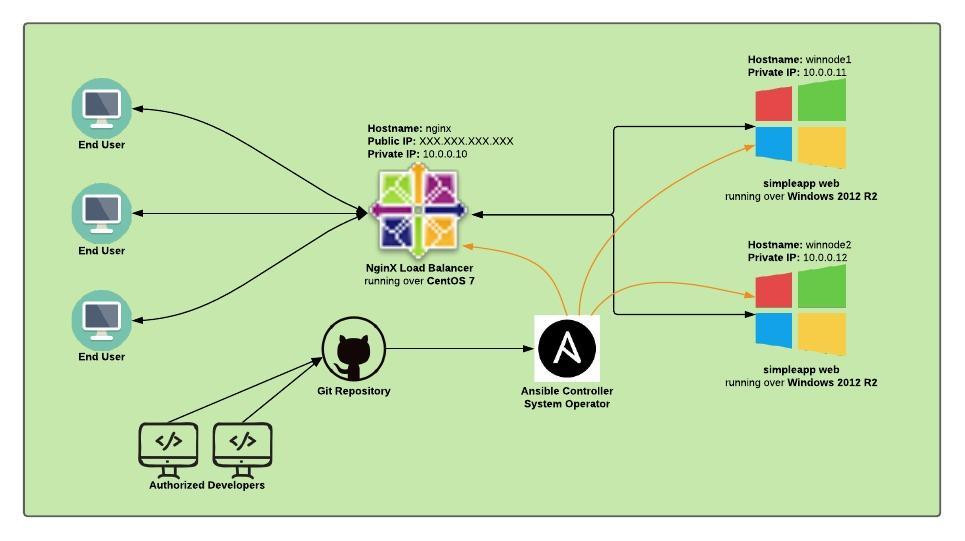

This repository was created exclusively to resolve a Configuration Management Challenge proposed by Edrans.
# Configuration Management Challenge by Alan Oltrabella

## Infrastructure Diagram

### Requirements
- **virtualbox >= 6.0.24**
- **vagrant >= 2.2.6**
- **ansible >= 2.9.6** (also ansible collection **'ansible.windows'** is needed)
- **python3 >= 3.8.5** (also python module **'pywinrm' >= 0.3.0** is needed)

### How to deploy the infrastructure

After cloning the repository to your local machine, just execute **'vagrant up'** inside the directory where **'Vagrantfile'** was copied.

### What is inside the 'ansible' directory??

Inside this directory you will find all playbooks and scripts I've created to get accomplished the tasks proposed in the challenge.

- **/nodes-config/** Holds all the configuration files asked to be present in the backend nodes. Also there are some directories used to deliver idividual node configurations to each node.
- **allnodesconfig.yml** Playbook created to deliver general node configuration files as 'main-config.ini' and 'customers.xml'
-  **ansible.cfg** Ansible configuration file.
-  **deployapp.yml** Playbook created to handle the deployment process of simpleapp new version.
-  **inventory** Ansible inventory file.
-  **newclient.sh** Simple bash script used to add a new costumer.
-  **newclient.yml** Playbook automatically executed by 'newclient.sh' to add new costumer information to 'costumers.xml' and deliver the updated file to the backend nodes.
-  **nodespecific.yml** Playbook that uses /nodes-config/ to deploy specific node configurations by passing an extra **'host'** var. Example: **ansible-playbook nodespecific.yml --extra-vars "host=node1"**